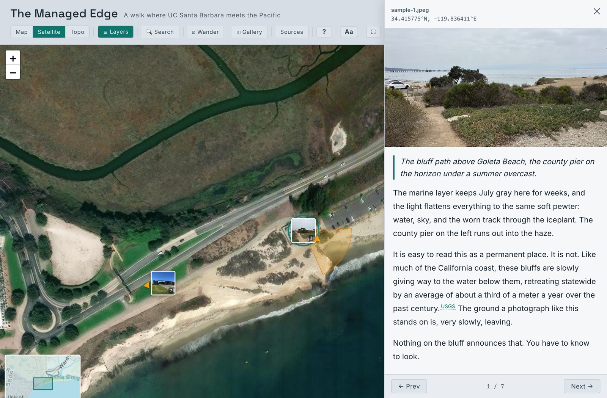
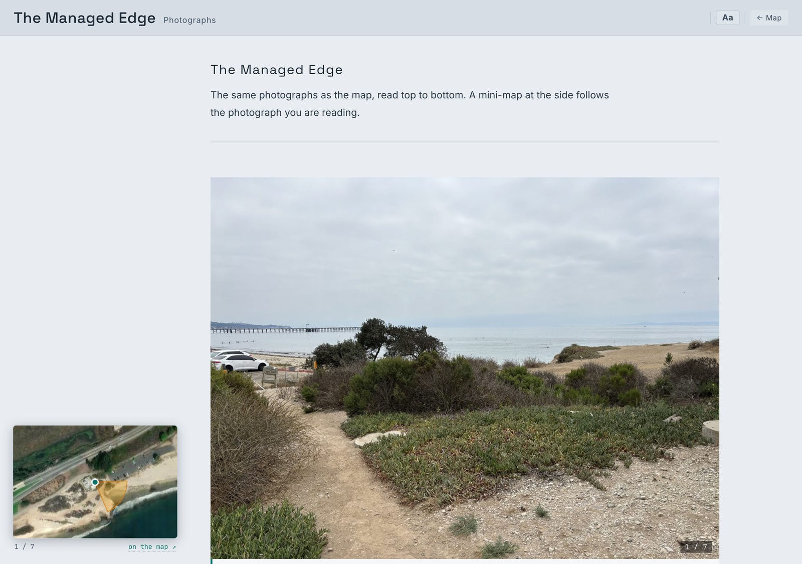
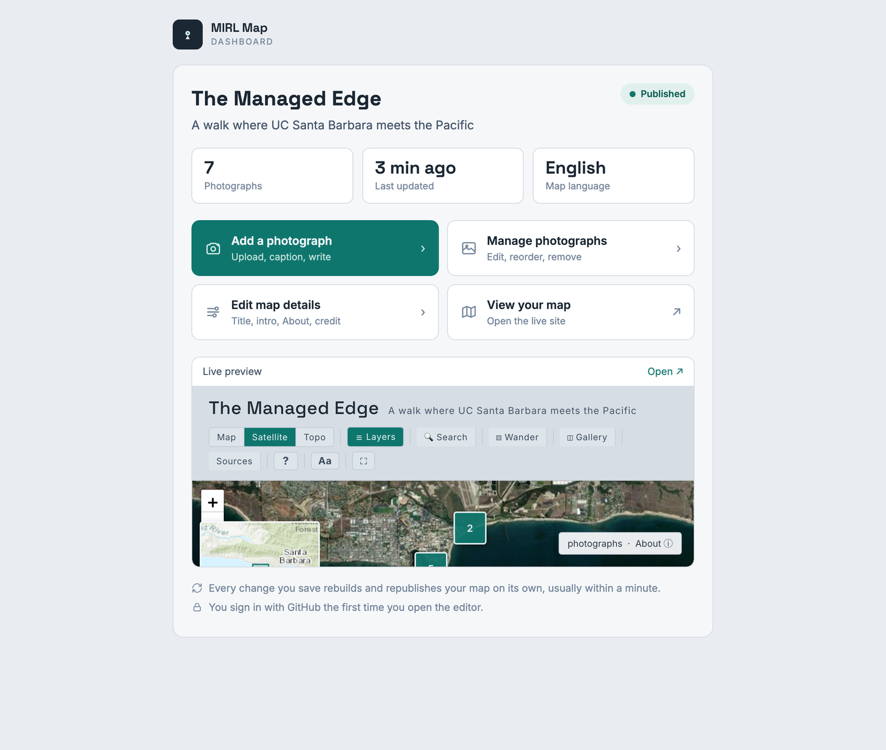

# MIRL Map

**Document a place through its photographs, and the writing that interprets them.**

MIRL Map turns a body of photographs into two readings of the same material: an
**interactive map**, where each image rests at the place it was made, and a
**photo essay** that moves through them in sequence. You pin each photograph,
give it a caption, and add as much interpretation as the work asks for. The
result is a living, shareable piece of place-based scholarship.

It was made for the **arts, humanities, and social sciences**: curators,
archivists, historians, artists, ethnographers, librarians, and community
researchers. **You do not need to know how to code to use it.**

To see a finished one, the [live example](https://mirl-ucsb.github.io/mirl-map-example/)
is a short documentary walk along the bluffs where the university meets the sea.

---

## Two readings of the same material

Every MIRL Map gives two ways through the same photographs and words.

**The map.** Your photographs appear where they were taken. A reader pans, zooms,
and opens any one to find its caption, your writing, its sources, and a link they
can cite or share. Nearby photographs gather into tidy clusters, so even hundreds
stay easy to browse, and a small cone can show the direction each camera faced.

**The essay.** The same photographs, read from first to last like a long-form
piece, with a small map alongside the page that follows as you read. This is the
slower, guided way through.

---

## What you might make with it

- A walk through a **neighborhood**, past and present.
- The rooms and details of a single **building** or monument.
- An **archaeological site** or excavation, photograph by photograph.
- A **memory map** of a place that has changed or disappeared.
- An **oral-history** project, with voices pinned to the places they describe.
- A **field survey**, an exhibition, a residency, a pilgrimage or migration route.

If a subject can be photographed and placed on a map, it can become a MIRL Map.

---

## Create your own map

**The simple way (recommended).** Visit the
[MIRL Map home page](https://mirl-ucsb.github.io/mirl-map-landing/) and choose
**Create your own map**. You sign in with GitHub, and a complete copy of the
platform is made in your own account, ready to fill in. It is free, and the map
is yours from the first moment. Within a minute or two your map and its editor
are live on the web.

**Self-hosting (for the independently minded).** You can also use this repository
as a template, host it yourself, and run your own login helper, for full
independence from MIRL's infrastructure. The steps are in
[ADMIN-SETUP.md](ADMIN-SETUP.md).

Either way, a new map starts empty, waiting for your first photograph.

---

## Adding photographs and writing

Each map has a **dashboard**, its home for editing. From there you add
photographs, write, and shape how the map reads, all through simple forms. There
are no files to touch and nothing to install.

- **Add a photograph.** Drag in an image, write a caption, and add a narrative if
  you like. **Its location is read from the photograph itself**, since most
  cameras and phones record where each photo was taken. No location saved? Click
  the map to place it, or type the coordinates.
- **Add many at once.** Upload a batch in the media library and import them
  together; each becomes a pin you then caption at your own pace.
- **Edit the map's details.** Set the title, the opening words, the credit line,
  and the **author and place used in citations**, all without editing code.
- **Save, and it publishes itself.** Your change appears on the live map within
  about a minute. Nothing else to press.

If you prefer working in plain text, every photograph is also just a small file,
and every field is explained in the [Content guide](CONTENT-GUIDE.md).

---

## What it does well

- **Words, with proper sources.** Note a source in your writing and it becomes a
  tidy footnote-style link, with a deduplicated source list under the narrative.
  Every photograph also carries a ready-made citation of itself, in **Chicago,
  MLA, APA, and BibTeX**.
- **Search** across every caption and every narrative at once.
- **Optional layers** you switch on as a project grows: a documented timeline, a
  statistics panel, first-person oral-history voices pinned to places,
  before-and-after historical photographs, historical map overlays you can slide
  against today, and outlines of areas or routes.
- **More than one language**, including right-to-left scripts such as Arabic.
- **Accessible by design**: larger text, high contrast, and reduced motion, all
  remembered between visits.
- **Open and free to publish.** Visitors need nothing but a web browser.

A new map is just your photographs and your words. Every further capability waits
quietly until you reach for it.

---

## Your work stays yours

- **You own your content.** Your photographs and your writing are yours, under
  whatever license you choose. Nothing is locked inside someone else's platform.
- **It is portable and lasting.** A MIRL Map is photographs, plain text, and a web
  page: formats that will still open years from now, on any host.
- **It is free to run.** No subscriptions.

---

## The guides

- **[Content guide](CONTENT-GUIDE.md)** walks through every field, one at a time,
  in plain language, with examples to copy.
- **[Admin setup](ADMIN-SETUP.md)** covers the editor and how to publish, whether
  you create a map through MIRL or host your own.

The map's title, opening words, citation details, and which optional features are
on are all set from the **Map details** form in your dashboard, not from any code
file.

If you get stuck, the MIRL team is glad to help.

---

## About

MIRL Map is made and maintained by the
**[Material / Image Research Lab (MIRL)](https://mirl.arthistory.ucsb.edu)** at the
University of California, Santa Barbara. It grew out of a documentary map of the
village of Lifta and was generalized so that any researcher, teacher, or community
could use the same method. The map is drawn with OpenStreetMap and Esri imagery,
and the code is openly commented for anyone who wants to look under the hood.

---

## License

The MIRL Map platform, meaning its code, styles, templates, and documentation, is
released under the MIT License. You are free to use it, fork it, and adapt it for
your own projects. The full text is in [LICENSE](LICENSE).

The license covers the platform, not what you put into it. Your photographs and
your writing stay entirely yours. The photographs in the live example are by Jeff
O'Brien and are shown by permission.

MIRL Map bundles one third-party component, leaflet-side-by-side (MIT), by Digital
Democracy.
